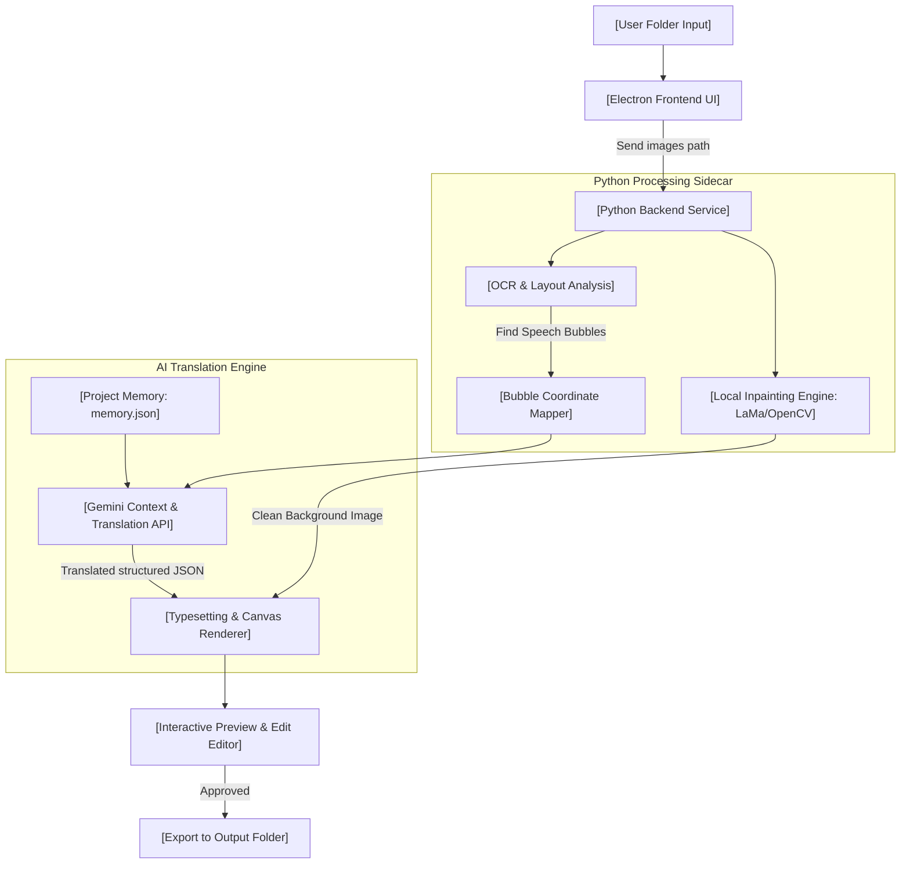

# ComicTranslator (เครื่องมือแปลมังงะและคอมมิกอัจฉริยะด้วย AI)
## แผนสถาปัตยกรรมและแผนการพัฒนาระบบ (Development Blueprint)

เอกสารนี้รวบรวมแผนการทำงาน สถาปัตยกรรมระบบ และสแต็กเทคโนโลยีที่จำเป็นสำหรับการสร้าง **ComicTranslator** เครื่องมือแปลภาษาการ์ตูนที่มุ่งเน้นการรักษาความถูกต้องของบริบทตัวละคร ชื่อเฉพาะ และฟอนต์จัดวางที่สวยงามแบบกึ่งอัตโนมัติ

---

## 🗺️ 1. ภาพรวมสถาปัตยกรรมระบบ (System Architecture)

ระบบจะทำงานเป็นแบบ **ลูกผสม (Hybrid Architecture)** เพื่อดึงจุดเด่นของเทคโนโลยีแต่ละส่วนมาใช้:
* **Frontend UI (Electron Desktop App)**: จัดการหน้าจอการใช้งาน (GUI) รับส่งไฟล์ หน้าจอแก้ไขก่อนส่งออก และการปรับแต่งสไตล์
* **Backend Sidecar (Python Local Service)**: รับผิดชอบงานประมวลผลกราฟิกหนัก ๆ (OpenCV, Inpainting) และการทำ OCR เนื่องจากฝั่ง Python มีไลบรารีวิเคราะห์ภาพที่เสถียรที่สุด

---

## 🛠️ 2. แผนการพัฒนาแบ่งตามระยะ (Phases of Development)

### Phase 1: ฐานระบบหลักและการแปลเทียบข้อความ (MVP Workflow)
* **เป้าหมาย**: สามารถนำเข้าโฟลเดอร์รูปภาพ แปลภาษา และเปิดตรวจสอบคำแปลซ้าย-ขวาแบบข้อความคู่ขนานได้
* **สิ่งที่ต้องพัฒนา**:
  1. หน้าจอหลัก Electron โหมด Dashboard จัดการคลังโปรเจกต์มังงะ
  2. ฟังก์ชัน **Drag & Drop Folder** อ่านและจัดเรียงไฟล์รูปภาพ
  3. ระบบเชื่อมต่อ **Gemini API (Multimodal)** ส่งหน้าภาพทั้งตอนเข้าวิเคราะห์และแปลภาษาแบบอ้างอิงบริบทดั้งเดิม
  4. หน้าต่าง **Side-by-Side Editor** แสดงรูปต้นฉบับคู่กับตารางคำแปลภาษาไทยที่ยอมให้ผู้ใช้ตรวจและดับเบิ้ลคลิกแก้ไขปรับแต่งคำพูดเองได้

### Phase 2: เครื่องยนต์ลบอักษรและถมสีพื้นหลัง (Image Inpainting)
* **เป้าหมาย**: ลบตัวอักษรภาษาอังกฤษเดิมออกจากกล่องข้อความโดยไม่ทำลายฉากการ์ตูนข้างหลัง
* **สิ่งที่ต้องพัฒนา**:
  1. ตัวตรวจจับพิกัดกล่องคำพูด (Speech Bubble Detector) ด้วย OpenCV
  2. อัลกอริทึม **Hybrid Erase**:
     * ถมสีขาวแบบเรียบลงพิกัดกล่องข้อความโดยตรง หากวิเคราะห์แล้วว่าเป็นฉากขาวธรรมดา (ช่วยลดภาระเครื่อง)
     * เรียกใช้งานโมเดล **LaMa (Large Mask Inpainting)** แบบ Local ในฝั่ง Python เพื่อกวาดลบตัวอักษรออกจากพื้นหลังที่เป็นฉากสกรีนโทนหรือรูปวาดสี
  3. ส่งออกผลลัพธ์ภาพที่สะอาดไร้ตัวอักษร (Clean Background Images) รอไว้ในระบบ Temp

### Phase 3: สมองกลจดจำเรื่องราวและพจนานุกรมกิลด์ (Project Memory & Glossary)
* **เป้าหมาย**: AI สามารถจดจำข้อมูลตัวละคร คำศัพท์เฉพาะ และรักษาความสม่ำเสมอในการแปลข้ามตอน
* **สิ่งที่ต้องพัฒนา**:
  1. โครงสร้างหน่วยความจำโครงการ `projects/[MangaName]/memory.json`
  2. หน้าจอจัดการตัวละคร (Character Profiler) ให้ผู้ใช้สามารถกำหนดชื่อไทย สรรพนามแทนตัว และคำติดปากของตัวละครแต่ละตัวได้
  3. ระบบ **Active Learning**: เมื่อผู้ใช้งานมีการแก้ไขคำสะกดในตอนที่ 1 (เช่น เปลี่ยนคำแปล "Haki" ➔ "ฮาคิ") ระบบจะอัปเดตเข้าคลังความจำของมังงะเรื่องนั้นโดยอัตโนมัติเพื่อให้การแปลในตอนต่อ ๆ ไปใช้คำนี้เสมอ

### Phase 4: ระบบจัดหน้าอักษรไทยอัจฉริยะและการคอมไพล์โปรแกรม (Typesetting & Export)
* **เป้าหมาย**: จัดวางตัวอักษรไทยลงไปในบอลลูนคำพูดให้พอดี สวยงาม และสามารถ Build เป็นไฟล์ติดตั้งนำไปใช้จริง
* **สิ่งที่ต้องพัฒนา**:
  1. เครื่องมือเขียนข้อความ (Text Canvas Renderer) รองรับการคำนวณพื้นที่วงรีของบอลลูนคำพูด
  2. ฟังก์ชัน **Auto-wrap** (ตัดคำขึ้นบรรทัดใหม่ตามขอบบอลลูน) และ **Auto-font-size** (ลดขนาดอักษรไทยอัตโนมัติหากประโยคยาวเกินช่องคำพูด)
  3. พัฒนาระบบลากและปรับตำแหน่งอักษรด้วยมือบนจอภาพ (Interactive Typesetter Manual Adjust) สำหรับหน้างานที่ยากเกินกว่า AI จะคำนวณตำแหน่งได้สมบูรณ์
  4. ทำระบบเขียนภาพทับแบบ High Resolution และบันทึกผลงานลงในโฟลเดอร์ปลายทาง
  5. คอมไพล์โปรแกรมให้ออกมาเป็นตัวติดตั้ง `.exe` สำเร็จรูปสำหรับ Windows

---

## 🎨 3. สแต็กเทคโนโลยีที่เลือกใช้ (Recommended Tech Stack)

| ส่วนประกอบ | เทคโนโลยีแนะนำ | เหตุผลทางเทคนิค |
| :--- | :--- | :--- |
| **โครงสร้าง GUI** | Electron + HTML5 / CSS / Vanilla JS | จัดการระบบไฟล์ในเครื่องได้ยืดหยุ่น สร้างหน้าต่างลอย และบิวต์เป็นโปรแกรมติดตั้งได้ง่าย |
| **การประมวลผลคำแปล** | Gemini 1.5 Pro / 2.5 Pro API | เป็นโมเดลมัลติโมดอลที่รองรับ Context ขนาดใหญ่ ส่งภาพพร้อมกันได้ทั้งตอนเพื่อคุมโทนการแปล |
| **กลไกหน่วยความจำ** | Local SQLite / JSON files | น้ำหนักเบา ไม่ต้องอาศัยคลาวด์ข้อมูล จัดการไฟล์ข้อมูลคำแปลแยกตามโปรเจกต์มังงะได้ง่าย |
| **ตัวลบอักษรต้นฉบับ** | LaMa (Local Python Service) | เป็น Inpainting Model ที่เกลี่ยลบตัวอักษรบนลวดลายศิลปะได้อย่างแนบเนียนและรันในเครื่องได้เร็ว |
| **ตัวประมวลผลเลย์เอาต์** | OpenCV (Python) | ช่วยค้นหาขอบพิกัดบอลลูนข้อความขาวและสกัดมาส์กข้อความเพื่อทำการถมภาพ |
| **ตัวจัดวางอักษรไทย** | HTML5 Canvas API | ให้ความยืดหยุ่นในการเขียนพิกเซล กำหนดสไตล์ วาดขอบเส้นสี (Stroke) และคำนวณการบีบฟอนต์อักษร |

---

## 📝 4. วิธีการสลับลำดับคิวและสายตา (Reading Flow Logic)

เพื่อให้การเรียงลำดับการพูดในช่องมังงะถูกต้อง ระบบจะใช้วิธี **Geometric Coordinate Sorting**:

* **กฎมังงะญี่ปุ่น (Manga - RTL)**:
  1. ลำดับความสูงของหน้าต่าง (แกน Y) จากบนลงล่าง
  2. หากกล่องข้อความอยู่ในระนาบความสูงใกล้เคียงกัน จะจัดลำดับจากพิกัดแกน X จากขวาไปซ้าย
* **กฎเว็บตูน (Webtoon - Scroll)**:
  1. จัดลำดับตามพิกัดดิ่งแกน Y เป็นหลัก เนื่องจากเป็นการเลื่อนอ่านลงล่างทีละช่อง

---

*แผนงานนี้จะใช้เป็นแนวทางหลักในการพัฒนาโปรเจกต์ **ComicTranslator** ในโฟลเดอร์นี้ต่อไปในอนาคตครับ!* 🧪📂✨
